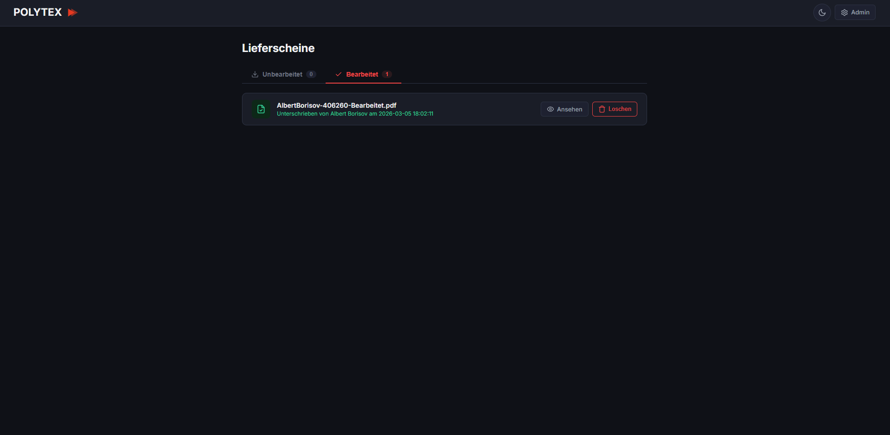
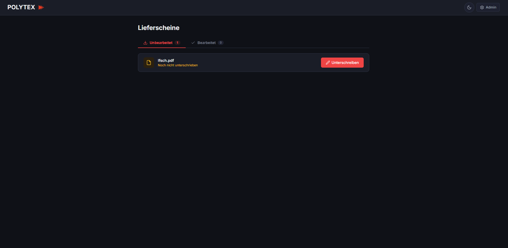
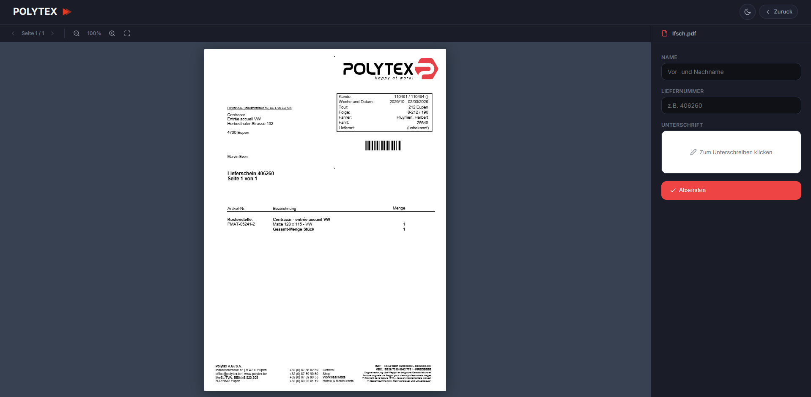
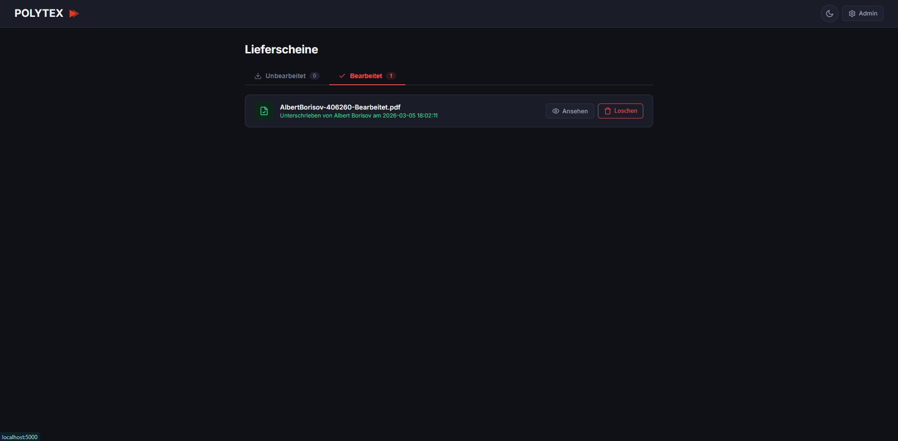
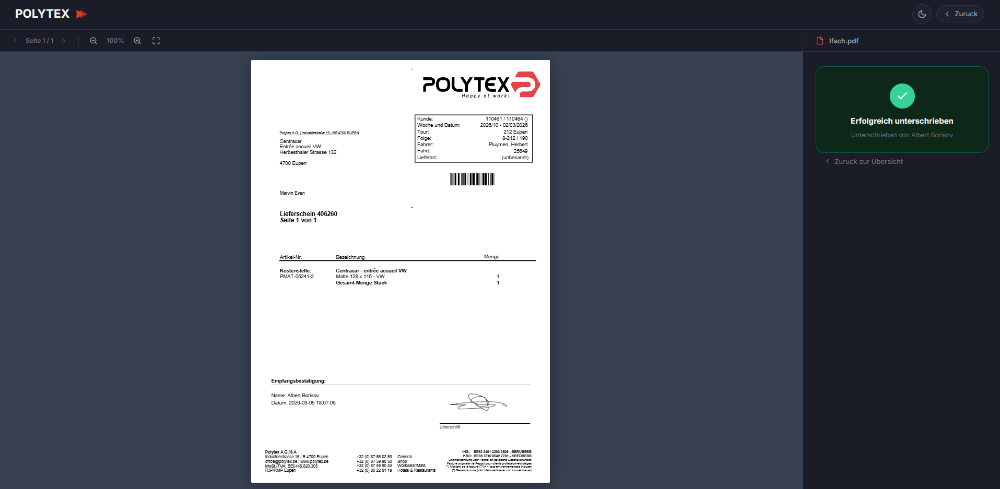

# Polytex — Digitale Lieferschein-Unterschrift

Webbasierte Anwendung zur digitalen Signierung von PDF-Lieferscheinen. Mitarbeiter können Lieferscheine anzeigen, unterschreiben und verwalten — direkt im Browser.


---

## Features

- **PDF-Viewer** — Lieferscheine direkt im Browser anzeigen (via pdf.js)
- **Digitale Unterschrift** — Freihand-Signatur per Maus oder Touch auf Canvas
- **Automatische Liefernummer** — Wird per Regex aus dem PDF-Text extrahiert
- **PDF-Einbettung** — Unterschrift wird dauerhaft ins PDF eingebettet (reportlab)
- **Dateiverwaltung** — Automatische Umbenennung und Verschiebung nach Signierung
- **Backup & Undo** — Originale werden gesichert, Signaturen können rückgängig gemacht werden
- **Admin-Panel** — Ordnerpfade konfigurieren, Statistiken einsehen
- **Dark Mode** — Umschaltbares Light/Dark-Theme

## Screenshots

### Übersicht — Unbearbeitete Lieferscheine


### PDF-Viewer mit Signaturformular


### Erfolgreich unterschrieben


### Übersicht — Bearbeitete Lieferscheine


### Admin-Panel


## Voraussetzungen

- Python 3.10+
- pip

## Installation

```bash
# Repository klonen
git clone https://github.com/Tyrone12345-cmd/polytex.git
cd polytex

# Virtuelle Umgebung erstellen & aktivieren
python -m venv venv
venv\Scripts\activate        # Windows
# source venv/bin/activate   # macOS/Linux

# Abhängigkeiten installieren
pip install -r requirements.txt
```

## Konfiguration

Beim ersten Start über das Admin-Panel (`/admin`) die Ordnerpfade festlegen:

| Einstellung | Beschreibung |
|---|---|
| **Unbearbeitet-Ordner** | Ordner mit unsignierten PDF-Lieferscheinen |
| **Bearbeitet-Ordner** | Zielordner für signierte PDFs |

Die Konfiguration wird in `config.json` gespeichert.

## Starten

```bash
python app.py
```

Die Anwendung ist unter **http://localhost:5000** erreichbar.

## Nutzung

1. **Übersicht** — Startseite zeigt unbearbeitete und bearbeitete Lieferscheine in Tabs (Echtzeit-Updates via WebSocket)
2. **Unterschreiben** — PDF auswählen → Name und Liefernummer eingeben (wird automatisch erkannt) → Unterschrift zeichnen → Absenden
3. **Ergebnis** — PDF wird signiert und als Ordner (`Liefernummer_Name/`) im Bearbeitet-Ordner gespeichert (inkl. Original-Backup und Metadaten)
4. **Rückgängig** — Im Tab "Bearbeitet" kann die Signatur gelöscht und das Original wiederhergestellt werden

## Projektstruktur

```
polytex/
├── app.py                 # Flask-Backend (Routen, PDF-Verarbeitung, WebSocket)
├── watcher.py             # Datei-Watcher (watchdog) — Echtzeit-Updates via WebSocket
├── config.json            # Ordnerkonfiguration (wird generiert)
├── .env.example           # Umgebungsvariablen-Vorlage
├── requirements.txt       # Python-Abhängigkeiten
├── static/
│   ├── style.css          # Designsystem (Light/Dark-Theme)
│   ├── signature.js       # Canvas-basierte Signaturerfassung
│   └── Logo Polytex.png   # Firmenlogo
├── templates/
│   ├── user.html          # Hauptübersicht (Tabs, Echtzeit-Updates)
│   ├── sign.html          # PDF-Viewer + Signaturformular
│   ├── admin.html         # Admin-Dashboard
│   └── admin_login.html   # Admin-Login
└── deploy/
    ├── setup.sh           # Server-Setup-Skript (Ubuntu/Debian)
    ├── polytex.service    # systemd-Service für Gunicorn
    └── nginx.conf         # Nginx Reverse-Proxy-Konfiguration
```

## Tech-Stack

| Komponente | Technologie |
|---|---|
| Backend | Flask 3.1, Flask-SocketIO |
| PDF-Verarbeitung | pypdf + reportlab |
| PDF-Anzeige | pdf.js 4.2 |
| Signatur | HTML5 Canvas |
| Echtzeit-Updates | WebSocket (Socket.IO) + watchdog |
| Styling | CSS Custom Properties |
| Speicher | Dateisystem (kein SQL) |
| Deployment | Gunicorn + Nginx + systemd |

---

## Deployment (Produktion)

### Voraussetzungen

- Ubuntu/Debian-Server
- Python 3.10+, Nginx, Git

### Automatisches Setup

```bash
# Repository auf den Server klonen
git clone https://github.com/Tyrone12345-cmd/polytex.git /root/polytex
cd /root/polytex

# Setup-Skript ausführen (als root)
chmod +x deploy/setup.sh
./deploy/setup.sh
```

Das Skript installiert alle Abhängigkeiten, richtet Nginx als Reverse-Proxy ein und startet die App als systemd-Service.

### Manuelles Setup

```bash
# Virtuelle Umgebung
python3 -m venv venv && source venv/bin/activate
pip install -r requirements.txt

# .env konfigurieren
cp .env.example .env
# SECRET_KEY und ADMIN_PASSWORD in .env anpassen

# Gunicorn starten
gunicorn --worker-class eventlet --workers 1 --bind 127.0.0.1:5000 app:app
```

### Verwaltung

```bash
systemctl status polytex      # Status prüfen
systemctl restart polytex     # Neustart
journalctl -u polytex -f      # Logs ansehen
```

---

## Entwicklungshistorie

### v1.0 — Initiales Release
- Flask-Backend mit PDF-Verarbeitung (pypdf + reportlab)
- Canvas-basierte digitale Unterschrift (Maus + Touch)
- PDF-Viewer im Browser via pdf.js
- Automatische Liefernummer-Erkennung aus PDF-Text (Regex)
- Dateiverwaltung: Signierte PDFs werden umbenannt und verschoben
- Backup-System: Originale werden gesichert, Signaturen rückgängig machbar
- Admin-Panel mit Ordnerkonfiguration und Statistiken
- Dark/Light-Theme mit CSS Custom Properties
- Screenshot-Dokumentation in README

### v1.1 — Admin-Panel & App-Erweiterungen
- Admin-Panel erweitert mit verbesserter Ordnerverwaltung
- Zusätzliche Statistiken im Dashboard
- User-Template-Verbesserungen

### v2.0 — Echtzeit-Updates, Security & Deployment
- **WebSocket-Integration**: Flask-SocketIO für Echtzeit-Dateiaktualisierungen
- **File Watcher** (`watcher.py`): Watchdog-basierte Ordner-Überwachung mit Debouncing — neue/geänderte PDFs erscheinen sofort bei allen verbundenen Clients
- **Ordner-basierte Ablage**: Signierte Dokumente werden in Unterordnern (`Liefernummer_Name/`) gespeichert mit:
  - `Bearbeitet.pdf` — signiertes PDF
  - `Original.pdf` — Backup des Originals
  - `Unterschrift.png` — Signaturbild
  - `info.json` — Metadaten (Name, Liefernummer, Datum, Dateinamen)
- **Security-Härtung**:
  - CSRF-Schutz auf allen POST/PUT/DELETE-Routen
  - Security-Header (CSP, X-Frame-Options, X-Content-Type-Options, Referrer-Policy)
  - Persistenter Secret Key (überlebt Neustarts)
  - Session-Cookie-Absicherung (HttpOnly, SameSite)
  - Path-Traversal-Schutz mit `_safe_name()` und `_is_within()`
- **Umgebungsvariablen**: `.env`-Datei-Unterstützung für SECRET_KEY, ADMIN_PASSWORD, FLASK_DEBUG
- **Verbesserte Liefernummer-Erkennung**: Mehrstufige Regex-Patterns (hoch/mittel + Dateiname-Fallback), Unicode-Normalisierung
- **Deployment-Skripte**: Komplettes Server-Setup mit `deploy/setup.sh`, Nginx-Konfiguration, systemd-Service
- **Health-Endpoint**: `/health` für Monitoring
- **Firmenlogo**: Polytex-Logo in die Oberfläche integriert
- **Template-Überarbeitung**: Alle Templates modernisiert und an neue Ordnerstruktur angepasst

## Lizenz

Dieses Projekt steht unter der [MIT-Lizenz](LICENSE).
